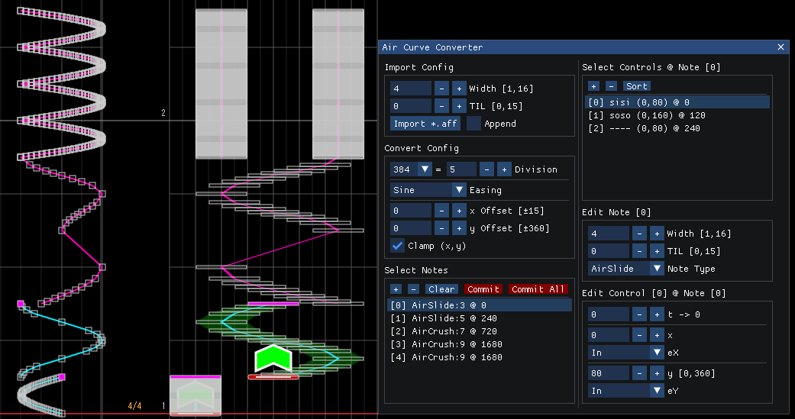

# Air Curve Converter Plugin for Margrete

Convert **Curve** patterns to `Slide`, `AirSlide`, and `AirCrush` notes – with optional import from `.aff` charts.



## Usage

- See the [wiki](https://github.com/Foahh/margrete-air-curve-converter/wiki/English) for detailed usage instructions.

- 详细使用说明请参见 [wiki](https://github.com/Foahh/margrete-air-curve-converter/wiki/中文)。

- 詳細な使用方法については [wiki](https://github.com/Foahh/margrete-air-curve-converter/wiki/日本語) をご覧ください。

## Build

### 1. Clone

```console
git clone https://github.com/Foahh/margrete-air-curve-converter
cd margrete-air-curve-converter
```

### 2. Install Prerequisites

| Tool                            | How to get it                                                                          |
| ------------------------------- | -------------------------------------------------------------------------------------- |
| **MSVC (Microsoft Visual C++)** | • Open **Visual Studio Installer** → select **Desktop development with C++** workload. |
| **CMake**                       | • If you chose **Desktop development with C++**, CMake is already installed.           |
| **vcpkg**                       | • Install via **Visual Studio Installer** → Individual components → **vcpkg**.         |

### 3. Run the build script

1. Open **PowerShell**.
2. Navigate to the project root.
3. Execute:

```powershell
./build.ps1 
```

### 4. Locate the output

The compiled DLL is placed in:

```txt
build/Release/
```

## Development

- C++20 / CMake ≥ 3.30
- Code style: clang-format (`.clang-format` in repo)
- Recommended IDE: **Visual Studio** or **CLion**

Feel free to open issues or submit pull requests.

## License

See [`LICENSE`](LICENSE) for details.
