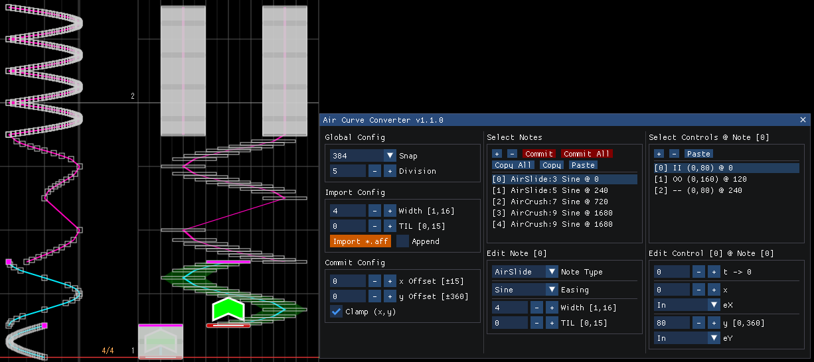

# Air Curve Converter Plugin for Margrete

Convert **Curve** patterns to `Slide`, `AirSlide`, and `AirCrush` notes – with optional import from `.aff` charts.



## Usage

- See the [wiki](https://github.com/Foahh/margrete-air-curve-converter/wiki/English) for detailed usage instructions.

- 详细使用说明请参见 [wiki](https://github.com/Foahh/margrete-air-curve-converter/wiki/中文)。

- 詳細な使用方法については [wiki](https://github.com/Foahh/margrete-air-curve-converter/wiki/日本語) をご覧ください。

## Build

### 1. Clone

```console
git clone https://github.com/Foahh/margrete-air-curve-converter
cd margrete-air-curve-converter
```

### 2. Install Prerequisites

| Tool                            | How to get it                                                                                                                                                                                                                                                                                                                                                   |
|---------------------------------|-----------------------------------------------------------------------------------------------------------------------------------------------------------------------------------------------------------------------------------------------------------------------------------------------------------------------------------------------------------------|
| **MSVC (Microsoft Visual C++)** | • Open **Visual Studio Installer** → select **Desktop development with C++** workload.<br> _or_<br>• Install the stand-alone **MSVC Build Tools** + **Windows SDK** (no full VS IDE required).                                                                                                                                                                  |
| **CMake**                       | • If you chose **Desktop development with C++**, CMake is already installed.<br> _or_<br>• Install via **Visual Studio Installer** → Individual components → **CMake**.<br> _or_<br>• Download binaries from <https://cmake.org/download/> and add them to `PATH`.<br> _or_<br>• Use a package manager: `winget install Kitware.CMake` / `choco install cmake`. |
| **vcpkg**                       | • Install via **Visual Studio Installer** → Individual components → **vcpkg**.<br> _or_<br>• Install manually: clone the repo and run the bootstrap script (see the "Install and use packages with CMake" [tutorial](https://learn.microsoft.com/en-us/vcpkg/get_started/get-started?pivots=shell-powershell)).                                                 |

### 3. Run the build script

1. Open **PowerShell**.
2. Navigate to the project root.
3. Execute:

```powershell
./build.ps1 -b -p release   
```

- `-b` tells the script to **build**.
- `-p` chooses the **build profile** (`Debug` or `Release`).

### 4. Locate the output

The compiled DLL is placed in:

```txt
out/build/<profile>/
```

where `<profile>` is `Debug` or `Release`, matching the profile you selected.

## Development

- C++20 / CMake ≥ 3.30
- Code style: clang-format (`.clang-format` in repo)
- Recommended IDE: **Visual Studio** or **CLion**

Feel free to open issues or submit pull requests.

## License

See [`LICENSE`](LICENSE) for details.
